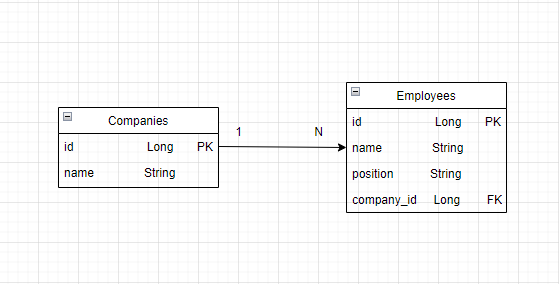

# Enoca-challenge

## Kullanılan Teknolojiler
* Java
* Maven
* Spring Boot (Version : 2.7.3)
* Postqresql
* Dependencies
==> Spring Web
-- Spring Boot DevTools
-- Lombok
-- Spring Data JPA

## Run
- Project > Run As> Maven Build  ``spring-boot:run``
### Company Controller

Method   |   Path   |   Description|Request Parameters
---------|----------|--------------|----------
POST     |/company| Bir Şirketi kaydeder|CompanyDto(Json Body)
GET      |/company/{id}|istenen şirketin bilgilerini alır|integer (id)
GET      |/company|Bütün şirketlerin listesini alır|
DELETE   |/company/{id}|Şirketi bilgilerini siler|integer (id)
PUT      |/company{id}| Şirket bilgilerini günceller|integer (id) 
 CompanyDto(Json body)

### Employee Controller

Method   |   Path   |   Description|Request Parameters
---------|----------|--------------|----------
POST     |/employee/{companyId}| Bir çalışanı şirket bilgisi ile beraber kaydeder|integer(companyId) EmployeeDto(Json Body)
GET      |/employee/{id}|İstenen müşterinin bilgilerini alır|integer (id)
GET      |/employee/allEmployees/{companyId}|Bir şirkette ki çalışanların listesini alır|integer(companyId)
DELETE   |/employee/{id}|Çalışan bilgilerini siler|integer (id)
PUT      |/employee{id}| Çalışan bilgilerini günceller|integer (id) 
 EmployeeDto(Json body)

### Model
- 

- CompanyDto 

  id  Long  

  name String
  
- EmployeeDto 

  name String 

  position String
